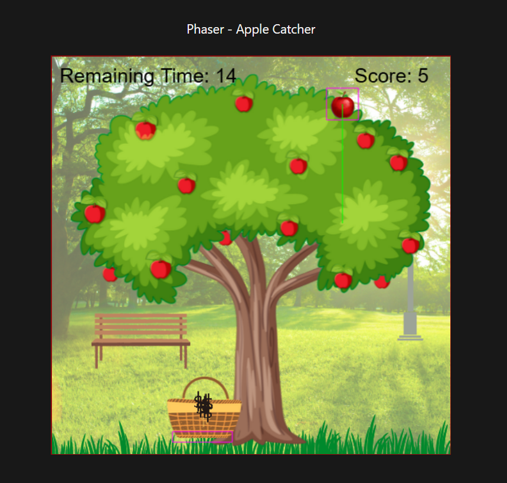

# Phaser Js - Apple Catch Game

This project is for training only. This project use PhaserJs to create a simple catching game, where the player have to collect apples within the set duration to win the game.

## Preview


## How to run this project
1. Clone this project
```
git clone https://github.com/mdavindarinaldy/phaser-apple-catch.git .
```
2. Install dependencies
```
npm install
``` 
3. Run the project
```
npm run dev
```
4. Project will running on http://localhost:5173

## Dependencies
This project using node.js to run, make sure to install node on your machine. Other than that, this project also using Vite and PhaserJs.

## Basic Information
- This project is based on https://github.com/digitaldeja0/Phaser-Apple-Catcher
- You should watch Deja's youtube video tutorial as well: https://youtu.be/0qtg-9M3peI?si=UrKe7K_xu0ynu5B_